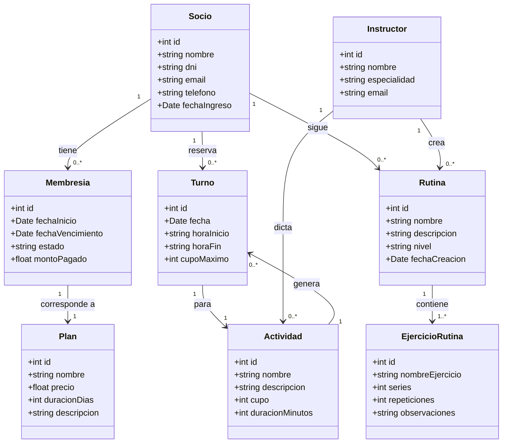

# Propuesta TP DSW

## Grupo

### Integrantes

* 52665 - Mistraletti, Alejo
* 54449 - Martinez, Ramiro
* 54483 - Borda, Iael
* 53796 - Alodi, Milton

### Repositorios

* [frontend app](http://hyperlinkToGithubOrGitlab)
* [backend app](http://hyperlinkToGithubOrGitlab)

## Tema

Sistema de gestión para gimnasio.

### Descripción

Sistema de gestión para un gimnasio que permite administrar socios, membresías,
rutinas e instructores. Los instructores pueden crear rutinas de entrenamiento
y asignarlas a los socios. Los socios pueden consultar el estado de su membresía
y acceder a rutinas de entrenamiento que les fueron asignadas por los instructores.
El personal administrativo gestiona altas, planes y pagos.

### Diagrama de clases

## Alcance Funcional

### Alcance Mínimo

Regularidad:

| Req | Detalle |
| --- | --- |
| CRUD simple | 1. CRUD Socio 2. CRUD Plan de Membresía 3. CRUD Instructor 4. CRUD Ejercicio |
| CRUD dependiente | 1. CRUD Membresía {depende de} CRUD Socio y CRUD Plan de Membresía 2. CRUD Rutina {depende de} CRUD Ejercicio |
| Listado + detalle | 1. Listado de socios filtrado por estado de membresía (activo/vencido) y/o nombre, muestra nombre, DNI y estado => detalle muestra datos del socio, membresía vigente y rutinas asignadas 2. Listado de Rutinas filtrado por nivel => detalle muestra datos completos de los ejercicios |
| CUU/Epic | 1. Registrar nuevo socio y asignarle un plan de membresía 2. Solicitar y asignar una rutina de entrenamiento: el socio la solicita y el instructor la arma asignándole ejercicios |

Adicionales para Aprobación:

| Req | Detalle |
| --- | --- |
| CRUD | 1. CRUD Socio 2. CRUD Plan de Membresía 3. CRUD Instructor 4. CRUD Ejercicio 5. CRUD Membresía {depende de} CRUD Socio y CRUD Plan de Membresía 6. CRUD Rutina {depende de} CRUD Ejercicio 7. CRUD Ejercicio 8. CRUD Rutina {depende de} CRUD Socio, CRUD Instructor y CRUD Ejercicio |
| CUU/Epic | 1. Registrar nuevo socio y asignarle un plan de membresía 2. Solicitar y asignar una rutina de entrenamiento: el socio la solicita y el instructor la arma asignándole ejercicios 3. Registrar una nueva rutina con ejercicios 4. Registrar pago de membresía y renovar vencimiento |

### Alcance Adicional Voluntario

| Req | Detalle |
| --- | --- |
| Listados | 1. Listado de actividades del dia, muestra horarios, descripcion, instructores, socios inscriptos y cupo restante 2. Socios con membresía próxima a vencer (en los próximos 7 días) |
| CUU/Epic | 1. Registrar reserva de cupo para un socio en una actividad 2. Cancelar reserva de cupo para un socio en una actividad |
| Otros | 1. Integración con sistema de pago |
